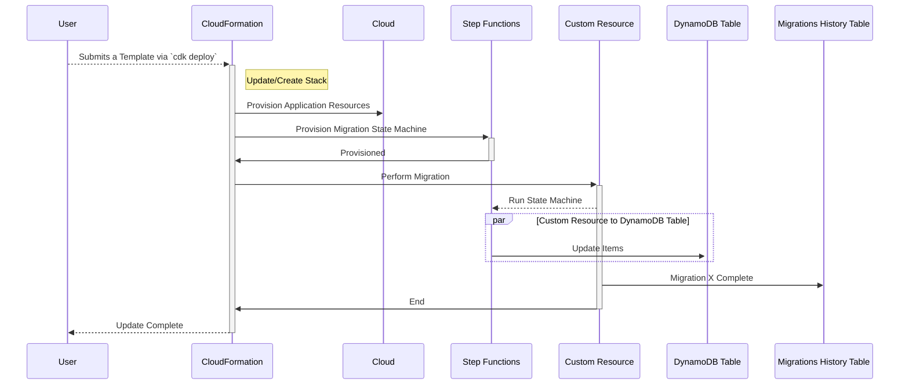

# dynamodb-migrations

[Functionless](https://github.com/functionless/functionless) mini-framework for DynamoDB migrations in AWS CDK. `dynamodb-migrations` leverages [Step Functions](https://aws.amazon.com/step-functions/) to enable massively parallel reads and writes to DynamoDB making your migrations faster.

`dynamodb-migrations` uses _"Migrations as Infrastructure"_ approach - each migration ends up being a separate State Machine, each one of them is deployed as a separate Stack.

Migrations are ran as a part of CloudFormation deployment cycle - each migration, provisioned as a state machine, gets invoked via CloudFormation Custom Resource which is also part of the stack itself.



> This repo is heavily in progress! Readme describes **desired** contract and functionality. Please do not try using it **yet!**. I'm not even sure if it's a good idea.

### Questions to answer / notes

- Why Step Function is better than just CloudFormation Custom Resource running some business logic?
  - Step Function can run up to a **year**. Singular lambda function - 15 minutes.
- What about throtting? Maybe it's easier thanks to Step Functions? Or maybe it's not? Think about token bucket.
- Is it possible to track migration progress? Probably some reporting can be added.
- Excessive resource provisioning might be a problem.
- Each state machine transition is a cost so one migration can be expensive.
- Maybe migrations table is not needed since each state machine is persistent?
  - It's definitely more convenient to have a table. State machines can be disposed after running.

## Installation / Getting Started

1. Install `dynamodb-migrations`:

```bash
npm i @dynobase/dynamodb-migrations --save
```

2. Include `Migrations` construct in the stack where your DynamoDB Table is located.

```ts
import { MigrationsManager } from '@dynobase/dynamodb-migrations';

...

new MigrationsManager(this, 'MigrationsManager', {
  migrationsDir: './migrations',
});
```

This will create an additional DynamoDB table that will be used to store the migrations history.

3. Initialize a new migration by using the `dynamodb-migrations init` command:

```bash
npx dynamodb-migrations init --dir ./migrations --name my-migration
```

4. Write an actual migration.

Following migration will add a new attribute called `migrated` to every item in the table.

```ts
import {
  MigrationFunction,
  ScanOutput,
  $AWS,
} from "@dynobase/dynamodb-migrations";

export const up: MigrationFunction = (scope, migrationName) =>
  new Migration(scope, migrationName, {
    tableArn: "arn:aws:dynamodb:us-east-1:123456789012:table/SubjectTable", // can be also read from StackOutputs
  }).run(async (_table, result: ScanOutput<any, any, any>) => {
    for (const item of result.Items as any[]) {
      await $AWS.DynamoDB.PutItem({
        Table: _table,
        Item: {
          ...item,
          migrated: {
            S: `migrated`,
          },
        },
      });
    }
  });
```

And that's it! This migration will be executed as a part of the next `cdk deploy` command fully under CloudFormation's control. After successfully running it, the migration will be marked as `migrated` in the migrations history table.
