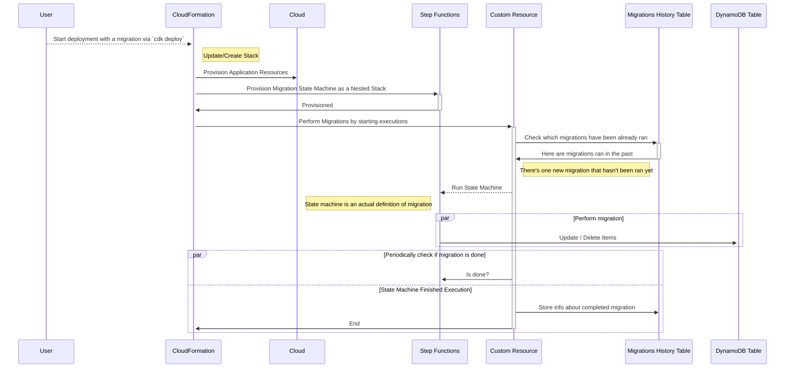

# dynamodb-migrations

> **This repo is heavily in progress!** Readme describes **desired** contract and functionality. Please do not try using it **yet!**. I'm not even sure if it's a good idea.

[Functionless](https://github.com/functionless/functionless)-based mini-framework for DynamoDB migrations in AWS CDK. `dynamodb-migrations` leverages [Step Functions](https://aws.amazon.com/step-functions/) to enable massively parallel reads and writes to DynamoDB making your migrations faster.

`dynamodb-migrations` uses _"Migrations as Infrastructure"_ approach - each migration ends up being a separate State Machine, each one of them is deployed as a separate Nested Stack.

Migrations are ran as a part of CloudFormation deployment cycle - each migration, provisioned as a state machine, gets invoked via CloudFormation Custom Resource which is also part of the stack itself.



### Questions to answer / notes

- Why Step Function is better than just CloudFormation Custom Resource running some business logic?
  - Step Function can run up to a **year**. Singular lambda function - 15 minutes.
- What about throtting? Maybe it's easier thanks to Step Functions? Or maybe it's not? Think about token bucket.
- Is it possible to track migration progress? Probably some reporting can be added.
- Excessive resource provisioning might be a problem.
- Each state machine transition is a cost so one migration can be expensive.
- Maybe migrations table is not needed since each state machine is persistent?
  - It's definitely more convenient to have a table. State machines can be disposed after running.

## Installation / Getting Started

1. Install `dynamodb-migrations`:

```bash
npm i @dynobase/dynamodb-migrations --save
```

2. Include `Migrations` construct in the stack where your DynamoDB Table is located.

```ts
import { MigrationsManager } from '@dynobase/dynamodb-migrations';

...

new MigrationsManager(this, 'MigrationsManager', {
  migrationsDir: './migrations',
});
```

This will create an additional DynamoDB table that will be used to store the migrations history.

4. Write an actual migration.

Create file called `20220101-add-attribute.ts` in the `migrationsDir` and paste following contents. This migration will add a new attribute called `migrated` to every item in the table.

```ts
import { $AWS } from "functionless";
import { unmarshall, marshall } from "typesafe-dynamodb/lib/marshall";
import { Migration, MigrationFunction } from "../..";

const tableArn =
  "arn:aws:dynamodb:us-east-1:085108115628:table/TestStack-TableCD117FA1-ZVV3ZWUOWPO";

export const migration: MigrationFunction = (scope, migrationName) => {
  const migrationDefinition = new Migration<any>(scope, migrationName, {
    tableArn,
    migrationName,
  });

  const table = migrationDefinition.table;

  // Actual migration code goes here.
  // For each item in the table
  migrationDefinition.scan(async ({ result }) => {
    for (const i of result.Items as any[]) {
      // Do the following
      await $AWS.DynamoDB.PutItem({
        Table: table,
        // Add migratedAt attribute to the item
        Item: marshall({ ...unmarshall(i), migratedAt: Date.now() }),
      });
    }
  });

  return migrationDefinition;
};
```

And that's it! This migration will be executed as a part of the next `cdk deploy` command fully under CloudFormation's control. After successfully running it, the migration will be marked as `migrated` in the migrations history table.

## Todo

- [x] Do not re-run previously applied migrations
- [x] Query and Scan functionality
- [x] Storing `executionArn` in the migrations history table
- [ ] Add an option for disposing state machines after running migrations
- [ ] Distinguish up/down migrations - if rollback is being performed, then Custom Resource should call `down` migration which will reverse the effect of the `up` migration
- [ ] Dry runs
- [ ] CLI for creating new migration files
- [ ] Better contract for writing migrations/semantics
- [ ] Reporting progress
- [ ] Package and publish to NPM
- [ ] More examples
